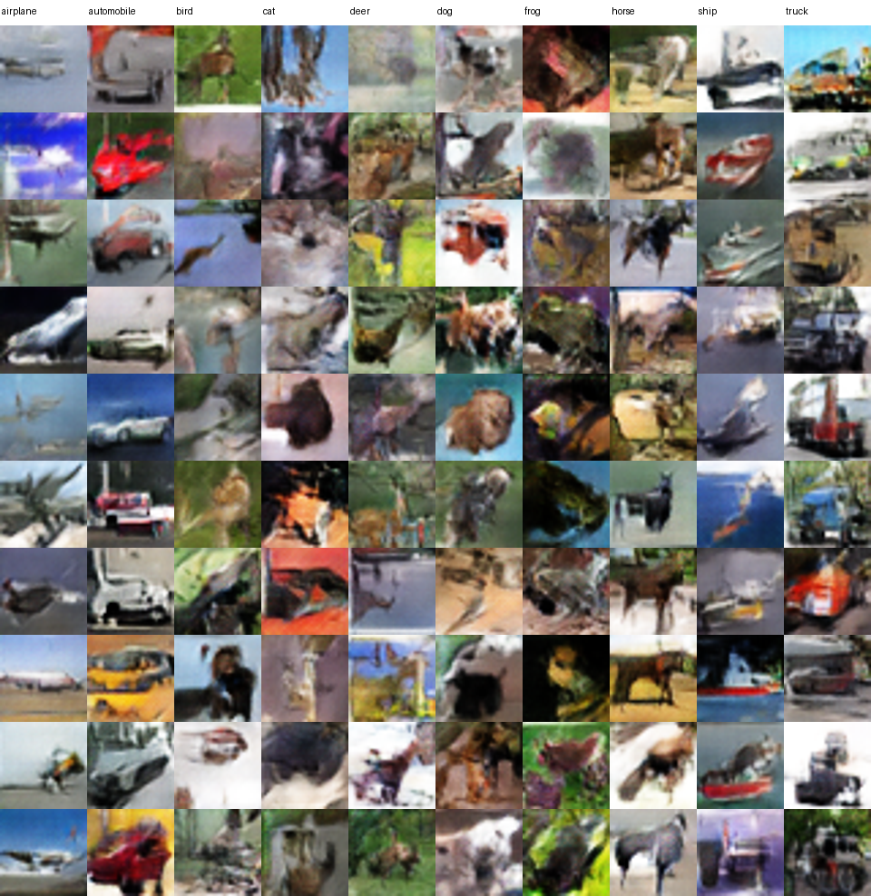

# GAN vs VAE for CIFAR-10 Image Generation

Can a GAN or a VAE produce the stronger CIFAR-10 image generator under a shared, frozen evaluation framework? This project develops both model families on CIFAR-10, freezes the selected candidate from each track, and compares them using protected-test FID, blinded visual review, requested-class adherence, and a nearest-neighbour audit.

**Author:** Agne Rudhresh



## Overview

The final conditional GAN was selected for the 1,000-image deliverable. Its advantage was supported by the complete evaluation rather than a single metric: substantially lower FID, stronger recognisability and class adherence, broader generated diversity, and no concerning evidence of direct training-image memorisation.

## The Question

Which frozen model family produces the stronger CIFAR-10 image generator when evaluated under one common protocol?

## Dataset

[CIFAR-10](https://www.cs.toronto.edu/~kriz/cifar.html) contains 60,000 32×32 RGB images across 10 classes: 50,000 official training images and 10,000 official test images. The notebooks load it with `tensorflow.keras.datasets.cifar10.load_data()`; the dataset is not redistributed here.

## Approach

### GAN

The selected model is a conditional DCGAN. It uses a 100-dimensional latent vector, a learned 50-dimensional class-label embedding, transposed-convolution upsampling, and `tanh` RGB output. The selected generator has 1,290,487 parameters. The notebook preserves the development path from Dense GAN and DCGAN foundations through WGAN-GP, controlled tuning, conditioning, augmentation, grayscale sensitivity analysis, and independent-seed confirmation.

### VAE

The frozen V04 candidate is a conditional convolutional VAE with a 64-dimensional latent space and one-hot class conditioning. Its decoder has 394,307 parameters. The VAE notebook retains decoder/latent/KL/conditioning/objective/optimiser experiments and the final V04 selection.

## Evaluation Protocol

After both candidate model families and the comparison rules were frozen, the official test set was used only for the final held-out evaluation. Each model generated 5,000 balanced requested-class images for each of three fixed seeds; FID used the same protected-test reference and frozen InceptionV3 feature pipeline. A separate masked visual comparison and identical feature-space nearest-neighbour audit supplemented FID.

## Results

Lower FID is better. The human review was blinded to model identity, but it used one scorer and is therefore supportive rather than objective ground truth.

| Metric | GAN | VAE |
| --- | ---: | ---: |
| Protected-test FID | 36.7096 ± 0.1153 | 147.1899 ± 0.6069 |
| Clear images | 50% | 0% |
| Requested class correct | 48% | 1% |
| Unique nearest training neighbours / 5,000 | 3,595 | 1,006 |

The absolute protected-test mean-FID difference was 110.4803. In the fresh blind review, the GAN received 50 Clear / 45 Marginal / 5 Nonsense ratings, versus 0 / 71 / 29 for VAE; requested-class ratings were 48 Correct / 30 Ambiguous / 22 Incorrect, versus 1 / 65 / 34.

## Why the GAN Won

The GAN combined much lower FID with more recognisable images, materially stronger requested-class adherence, and broader generated diversity. Neither model showed concerning direct training-image proximity in the audit, so there was no memorisation evidence that reversed the result.

## Generated Samples

The grid above is built only from the existing final outputs. [`artifacts/final_1000_images.zip`](artifacts/final_1000_images.zip) preserves the original 1,000 GAN PNGs: 100 requested images for each CIFAR-10 class.

## Memorisation Audit

For 5,000 frozen generated samples per model, nearest training neighbours were measured in L2-normalised InceptionV3 feature space using cosine distance. Neither generator produced samples unusually close to training images relative to the unseen-real test baseline. The VAE did, however, reuse neighbours much more heavily (79.88% duplicate assignments versus 28.10% for GAN), consistent with stronger mode concentration rather than direct copying.

## Repository Structure

```text
notebooks/   Cleaned public notebooks and preserved evidence
reports/     HTML versions regenerated from those notebooks
models/      Frozen GAN and V04 VAE loading artifacts
assets/      README-ready sample grid built from final PNGs
artifacts/   Original final 1,000-image set as a zip archive
```

## Running the Project

Install the small dependency set below, then open a notebook from `notebooks/`. The notebooks are public research records: they preserve results and frozen evaluation evidence, but do not include CIFAR-10 or the full historical checkpoint directories needed to rerun every training experiment. The final comparison loads the published frozen artifacts from `models/`.

```bash
python -m pip install -r requirements.txt
jupyter lab
```

## Limitations

- Class conditioning remained imperfect, especially for several animal classes.
- The visual evaluation used one scorer; no inter-rater agreement is available.
- Seed-level confirmation was limited, particularly for VAE training.
- A nearest-neighbour audit cannot prove the complete absence of memorisation.

## My Contribution

This was a two-person Deep Learning project.

My primary responsibilities included:

- leading the GAN experimentation track
- leading shared EDA and preprocessing
- experiment/evaluation design
- protected-test comparison methodology
- GAN vs VAE integration and final model selection
- reproducibility and final deliverable checks

The VAE experimentation track was primarily developed by my project partner, with both of us reviewing the overall comparison and conclusions.

### Collaborator

[](https://github.com/xTurtleXP) [](https://www.linkedin.com/in/mohamadaniq/)

## Coursework Context

This is a privacy-clean, standalone public version of Part A of a collaborative Deep Learning coursework project. It preserves the experiment record and conclusions without publishing submission material, student identifiers, or private contact details.

## License

No license has been selected. Choose one before publishing if you want to grant reuse rights.
